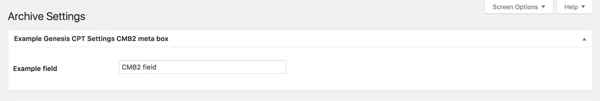

# README #

This plugin simplifies adding CMB2 meta boxes to the Genesis Theme Settings and Genesis CPT Archive Settings pages.



## Requirements
PHP 5.4+

## Installation

Download the zip file and install it using the WordPress plugin installer.

## Usage

Meta boxes can be added to the Genesis Theme Settings page or to Genesis CPT Archive Settings pages.  Make sure your custom post types have support for `'genesis-cpt-archives-settings'`.

- Use the helper function `genesiscmb2_add_theme_settings_box()` to add meta boxes to Genesis Theme Settings.
- Use the helper function `genesiscmb2_add_cpt_archive_box()` to add meta boxes to Genesis CPT Archive Settings. For example:
```php
$cpt_config = [
	[
		'metabox' => [
			'title'        => 'Example Genesis CPT Settings CMB2 meta box', // String. Translation function is handled by the class.
			'object_types' => [ 'new-post-type', 'new-post-type-2' ], // Array. CPT slug(s).
		],
		'fields'  => [
			[
				'name'    => 'Example field',
				'id'      => 'example_cmb2_field',
				'type'    => 'text',
			],
			// Add additional field array(s) here.
		],
	],
	// Add additional meta box array(s) here.
];

genesiscmb2_add_cpt_archive_box( $cpt_config );
```
- See example configuration arrays in the `config` directory. In general, use the same arguments for creating meta boxes and fields as you [normally would with CMB2](https://github.com/CMB2/CMB2/wiki/Basic-Usage#create-a-metabox). It is not necessary to include `'id'` or `'context'` in the `'metabox'` array.
- Retrieve the custom field values using `genesis_get_option( $field_id )` and `genesis_get_cpt_option( $field_id )`.

## Limitations
Group fields are not currently supported.

## Credits
Major props to [Justin Sternberg](https://twitter.com/Jtsternberg) for the heavy lifting.  This plugin is simply a repackaging of the Justin's example code provided in the [CMB2 Snippet Library](https://github.com/CMB2/CMB2-Snippet-Library/tree/master/options-and-settings-pages).
